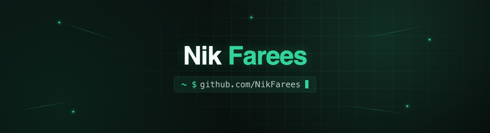

<!-- Banner: upload banner.png to this repo, or swap src for a hosted URL -->


# Backend Developer: Laravel & Next.js

Backend developer working mainly in Laravel and Filament. That's what powers the management systems and admin platforms I build. On the frontend side I use Next.js when a project needs one. Between the two I've shipped 3+ management systems and a real-time auction platform serving 100+ concurrent users, plus the Docker setup and CI/CD pipelines behind them. Software Engineering grad from UniKL MIIT (CGPA 3.81).


### Stack

<details>
<summary><strong>Languages</strong></summary>
<br>


</details>

<details>
<summary><strong>Backend</strong></summary>
<br>


</details>

<details>
<summary><strong>Frontend</strong></summary>
<br>


</details>

<details>
<summary><strong>DevOps</strong></summary>
<br>


</details>

<details>
<summary><strong>Database</strong></summary>
<br>


</details>


### Live Stats

<table>
<tr>
<td valign="top" width="50%">


</td>
<td valign="top" width="50%">


</td>
</tr>
</table>

<picture>
  <source media="(prefers-color-scheme: dark)" srcset="https://raw.githubusercontent.com/NikFarees/NikFarees/output/github-contribution-grid-snake-dark.svg" />
  <source media="(prefers-color-scheme: light)" srcset="https://raw.githubusercontent.com/NikFarees/NikFarees/output/github-contribution-grid-snake.svg" />
  
</picture>

<!--START_SECTION:waka-->


📊 **This Week I Spent My Time On** 

```text
🔥 Editors: 
No Activity Tracked This Week
```

**I Mostly Code in PHP** 

```text
PHP                      21 repos            ██████████░░░░░░░░░░░░░░░   38.89 % 
TypeScript               7 repos             ███░░░░░░░░░░░░░░░░░░░░░░   12.96 % 
JavaScript               4 repos             ██░░░░░░░░░░░░░░░░░░░░░░░   07.41 % 
Blade                    4 repos             ██░░░░░░░░░░░░░░░░░░░░░░░   07.41 % 
Dart                     2 repos             █░░░░░░░░░░░░░░░░░░░░░░░░   03.70 % 
```


 Last Updated on 04/07/2026 02:19:24 UTC
<!--END_SECTION:waka-->


### Contact

[](https://fareeslab.dev)
[](https://linkedin.com/in/nikfarees)
[](mailto:nfarees.faizal@gmail.com)
